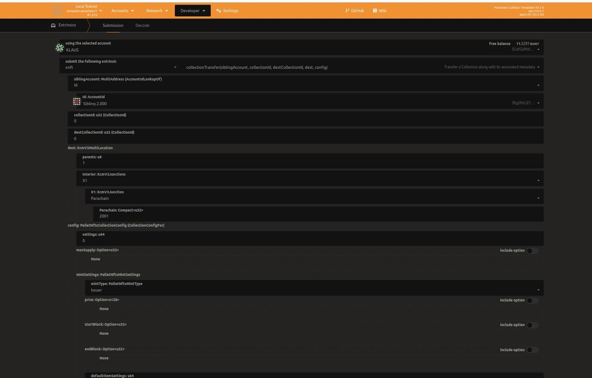

# USER GUIDE
This guide includes steps for a user to leverage the xNFT pallet to transfer NFT cross-chains

## Prerequisites
1. Establish bidirectional HRMP channel between parchains through relay chain. For help, use [this](https://docs.substrate.io/reference/how-to-guides/parachains/add-hrmp-channels/) guide.
2. Create a collection, and mint some NFTs using the [NFT Pallet](https://github.com/antiers-solutions/xNFT/tree/master/nfts).
3. Sibling account(as per the ParaID) must have enough funds for paying fees and to lock some funds until NFT is transfered.

## Following are the steps that you will need to follow in order to use the xNFT functionality:-
#### **COLLECTION TRANSFER**
Here we are transferring the collection with collection ID = 0 along with its associated metadata. 

1. Transfer the collection to destination chain through xNFT pallet. 
- Go to developers tab then go to extrinsics.
- Select **xNFT** pallet inside this select **collectionTransfer** function. Set the parameters as per your requirement.

**Events popped at source chain will be as follows:-**
- collectionSent
- collectionMetadataTransfer
- collectionTransferedSuccessfully

**Events popped at destination chain will be as follows:-**
- created
- success 
- collectionMetadataSet

#### **NFT Transfer**
Here we are transferring NFT with NFT ID = 0 present at collection with collection_id = 0. It transfers NFT along with its associated metadata and assign a new owner to the NFT. 
2. Transfer the NFT.
- Go to developers tab then go to extrinsics.
- Select **xNFT** pallet inside this select **nftTransfer** function. Set the parameters as per your requirement.

**Events popped at source chain will be as follows:-**
- NftSent
- itemMetadataTransfered
- nftOwnershipTransfered
- Burned

**Events popped at destination chain will be as follows:-**
- issued 
- success 
- itemMetadataSet
- transfered

#### **TRANSFER MULTIPLE NFTs**
Here we are transferring NFTs with NFT ID = 1,2,3 present in collection with collection ID = 0. It transfers just the NFTs at the destination chain.
3. Transfer the multi NFT. 
- Go to developers tab then go to extrinsics.
- Select **xNFT** pallet inside this select **transferMultiNfts** function. Set the parameters as per your requirement.

**Events popped at source chain will be as follows:-**
- NftSent
- Burned

**Events popped at source chain will be as follows:-**
- issued 
- success

#### **TRANSFER NFT METADATA**
Here we are transferring above sent NFTs metadatas. 
4. Transfer metadata of NFTs. 
- Go to developers tab then go to extrinsics.
- Select **xNFT** pallet inside this select **transferNftMetadata** function. Set the parameters as per your requirement.

**Events popped at source chain are as follows:-**
- itemMetadataTransfered

**Events triggered at destination chain are as follows:-** 
- itemMetadataSet
- Success

#### **TRANSFER NFT OWNERSHIP**
Here we're assigning the ownership of NFTs sent in step 10. 
5. Change the owner of the NFTs.
- Go to developers tab then go to extrinsics.
- Select **xNFT** pallet inside this select **tansferNftsOwnership** function. Set the parameters as per your requirement.

**Events popped at source chain are as follows:-**
- NftOwnershipTransfered
      

**Events triggered at destination chain are as follows:-** 
- transfered
- Success

#### **COLLECTION OWNER TRANSFER**
Here we change the owner of collection that is being sent from source chain to destination chain.For this we need to accept the ownership at destination chain for the collection of which we are changing the ownership.
6. Change the owner of the collection.
- Go to destination chain.
- Go to developers tab then go to extrinsics.
- Select **NFT** pallet inside this select **setAcceptOwnership** function. Set the parameters as per your requirement.

- Then go back to the source chain select developer tab.Next, select extrinsics. 
- Select **xNFT** pallet inside this select **transferCollectionOwnership** function. Set the parameters as per your requirement.

**Events popped at source chain are as follows:-**
- collectionOwnershipTransfer
      

**Events triggered at destination chain are as follows:-** 
- ownerChanged
- Success
